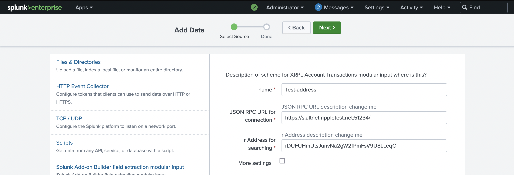
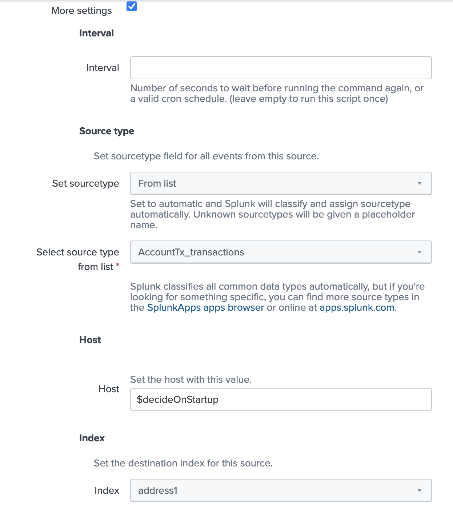
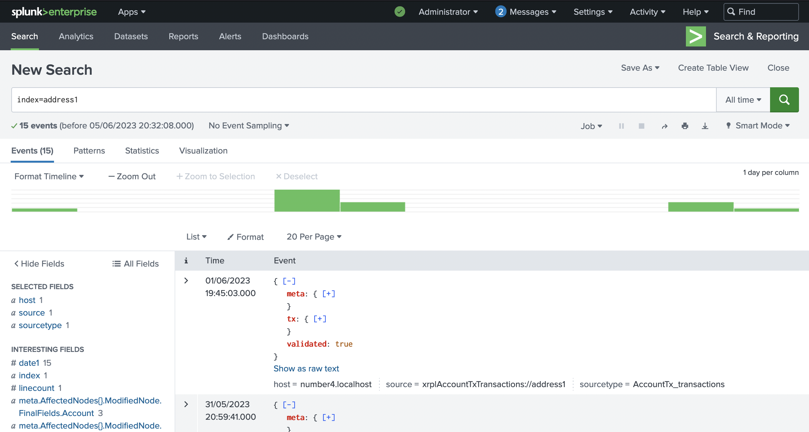
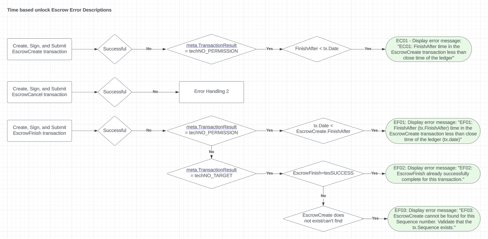

xrplModularInput
================

.. _installation:

Installation
------------

Options:
. Install latest build xrplModularInput.sql file from the latest_builds/ folder
. Clone the repo (optionally edit) and build the Splunk app

Install latest build xrplModularInput.sql
^^^^^^^^^^^^^^^^^^^^^^^^^^^^^^^^^^^^^^^^^

. Download the file
. Start Splunk UI
. Apps > install from file > upload the .sql file

Add an address to get all the transactions for
^^^^^^^^^^^^^^^^^^^^^^^^^^^^^^^^^^^^^^^^^^^^^^

#. Install the add-on
#. Setting > Data Inputs > xrplModularInputs > +Add new
#. Provide a name for the input
#. Provide a client connection string e.g. https://s.altnet.rippletest.net:51234/ 
#. Provide an address to gather transactions for e.g. rDUFUHmUtsJunvNa2gW2fPmFsV9U8LLeqC
#. (Optionally) clicl the "more options" and add index, sourcetype, interval etc.

Transaction Types
-----------------

Escrow Transactions
^^^^^^^^^^^^^^^^^^^

Escrow has 3 transaction types: EscrowCreate, EscrowCancel, EscrowFinish

Escrow Transactions Errors
^^^^^^^^^^^^^^^^^^^^^^^^^^

Escrow transactions (Create, Cancel, Finish) can produce errors (https://xrpl.org/tec-codes.html) for various well defined reasons, though it is not always simple to identify the cause of the errors from the codes provided. We are able to automatically enrich these error codes with the cause.

The below flow diagram shows the currently configured error code enrichment for Escrow transactions.

